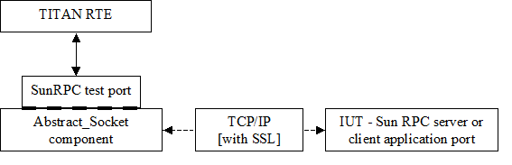

= SunRPCasp_CNL113493 Test Port for TTCN-3 Toolset with TITAN, Function Specification
:author: Eduárd Czimbalmos
:revnumber: 155 17-CNL 113 493, Rev. A
:revdate: 2007-02-09
:toc:

== How to Read This Document

This is the Function Specification for the SunRPCasp_CNL113493 (called SunRPC from now on) test port. The SunRPC test port is developed for the TTCN-3 Toolset with TITAN. This document is intended to be read together with the User’s Guide <<_3, [3]>>.

== Scope

The purpose of this document is to specify the functionality of the SunRPC test port. The document is primarily addressed to the end users of the product. Basic knowledge of TTCN-3, TITAN TTCN-3 Test Executor and the Sun RPC protocol is valuable when reading this document (see <<_1, [1]>> and <<_2, [2]>>).

This document is based on specifications of the Remote Procedure Call (Sun RPC) defined by RFC 1057 (see <<_4, [4]>>).

= General

The SunRPC Test Port makes possible to execute test suites towards an IUT. The test port allows sending and receiving Sun RPC messages between the test suite and IUT via a TCP/IP socket connection.

If there are <<Multiple_connections, multiple connections>> established every connection gets an 'id' when it is established. When sending `SunRPC_message_multiple_client` messages, the `client_id` parameter selects the connection on which the message should be sent.

If there is only a <<Multiple_connections, single connection>> established, the `SunRPC_message` can be sent and received by the test suite.

The communication between the SunRPC test port and the TITAN RTE is done by using the API functions described in <<_2, [2]>>. The SunRPC test port transfers the Sun RPC protocol messages to the IUT through a network connection.

See the overview of the protocol message transfer network below:

= Function Specification

== Implementation

=== Environment

The SunRPC test port makes use of the services provided by the UNIX socket interface. When connecting to an SSL enabled IUT, the connection is secured with the OpenSSL toolkit based on configuration data. Every test port is able to handle one listening (server) port and multiple TCP connections.

=== Module Structure

The SunRPC test port is implemented in the following TTCN-3 modules:

* __SunRPCasp_Types.ttcn__
* __SunRPCasp_PortType.ttcn__

The file __SunRPCasp_Types.ttcn__ defines the Sun RPC message types and the TCP connection controlling ASPs. The port type is defined in __SunRPCasp_PortType.ttcn__.

The c++ implementation of the test port is contained in the following files:

* __SunRPCasp_PT.hh__
* __SunRPCasp_PT.cc__

The port is using the `Abstract_Socket`, a common component with the product number CNL 113 384, implementing the basic sending, receiving and socket handling routines. The following files should be included in the _Makefile_:

* __Abstract_Socket.hh__
* __Abstract_Socket.cc__

== Configuration

The configuration of the SunRPC test port is done by the TITAN RTE configuration file. The description of the specific parameters can be found in the SunRPC test port User’s Guide <<_3, [3]>>.

== Start Procedure

After the test port is mapped by TITAN RTE to the IUT system’s interface port, it waits for a `ASP_SunRPC_Connect` or a `ASP_SunRPC_Listen` ASP.

The `ASP_SunRPC_Connect` ASP sets up a connection toward an SunRPC server implementation, on which instances of `SunRPC_message` or `SunRPC_message_multiple_client` Messages can be sent and received. After sending the `ASP_SunRPC_Connect` ASP, the `ASP_SunRPC_Connect_result` is returned to the test with a `client_id`, which is `_"–1"_`, if the connection was unsuccessful, or the unique id of the opened connection.

The `ASP_SunRPC_Listen` ASP commands the test port to wait for incoming connections from SunRPC clients by opening a listening port. After sending the `ASP_SunRPC_Listen` ASP, the `ASP_SunRPC_Connect_result` is returned to the test with a `client_id`, which is `_"–1"_`, if the connection was unsuccessful, or the unique id of the opened connection. If a connection gets accepted, the `ASP_SunRPC_Connected` ASP is sent to the test suite with the parameters of the incoming connections.

[[sending-receiving-sunrpc-messages]]
== Sending/Receiving SunRPC Messages

The SunRPC test port is able to send and receive `SunRPC_message` and `SunRPC_message_multiple_client` structures. The `SunRPC_message_multiple_client` is a record of a `client_id` and a `SunRPC_message`, enabling the test suite to handle multiple clients through the same test port instance. The structure of the `SunRPC_message` message is described in <<_4, [4]>>.

The test port sends and receives the messages over the TCP/IP protocol, and does the encoding and decoding of the Record Marking Standard (see <<_4, [4]>>) automatically.

== Closing Down

[[asp-sunrpc-close]]
=== ASP_SunRPC_Close

The `ASP_SunRPC_Close` shuts down the client connection between the test port and the IUT. The `client_id` parameter of the `ASP_SunRPC_Close` ASP identifies the connection to be closed. If it is set to omit, all current connections will be closed.

The test suite receives `ASP_SunRPC_Close` if the remote end closes the connection.

[[asp-sunrpc-shutdown]]
=== ASP_SunRPC_Shutdown

Instructs the test port to close the server listening port. The client connections will remain open. The server will not accept further client connections until an `ASP_SunRPC_Listen` ASP is sent again.

== Logging

The type of information that will be logged can be categorized into two groups. +
The first one consists of information that shows the flow of the internal execution of the test port, for example, important events, which function that is currently executing, etc.

The second group deals with presenting valuable data, for example, presenting the content of a PDU. The logging printouts will be directed to the RTE log file. The user is able to decide whether logging is to take place or not by setting appropriate configuration data, see <<_2, [2]>>.

== Error Handling

Erroneous behavior detected during runtime may be presented on the console and directed into the RTE log file. The following two types of messages are taken care of:

* Errors - information about errors detected is provided. If an error occurs the execution of the test case will stop immediately. The test ports will be unmapped.
* Warnings - information about warnings detected is provided. The execution continues after the warning is shown.

== SSL functionality

The SSL functionality is optional, and is not present in the compiled test port by default.

The SSL implementation is based on the same OpenSSL as TITAN (OpenSSL 0.9.8a). Protocols SSLv2, SSLv3 and TLSv1 are supported. For more information on OpenSSL and installation see <<_5, [5]>>.

=== Compilation

The usage of SSL and even the compilation of the SSL related code parts are optional. This is because SSL related code parts cannot be compiled without the OpenSSL installed.

Defining the `AS_USE_SSL` macro in the _Makefile_ enables the compilation of SSL related code parts. If the macro is defined in the _Makefile_, the SSL code parts are compiled to the executable test code, and the test port will work only through SSL. For more information about the compilation see <<_3, [3]>>.

=== Authentication

The test port provides both server side and client side authentication. When authenticating the other side, a certificate is requested and the own trusted certificate authorities’ list is sent. The received certificate is verified whether it is a valid certificate or not (the public and private keys are matching). No further authentication is performed (e.g. whether hostname is present in the certificate). The verification can be enabled/disabled in the runtime configuration file, see <<_3, [3]>>.

In server mode the test port will always send its certificate and trusted certificate authorities’ list to its clients. If verification is enabled in the runtime configuration file, the server will request for a client’s certificate. If the client does not send a valid certificate, the connection will be refused. If verification is disabled, then the connection will be accepted even if the client does not send or send an invalid certificate.

In client mode the test port will send its certificate to the server on the server’s request. If verification is enabled in the runtime configuration file, the client will send its own trusted certificate authorities’ list to the server and will verify the server’s certificate as well. If the server’s certificate is not valid, the SSL connection will not be established. If verification is disabled, then the connection will be accepted even if the server does not send or send an invalid certificate.

The own certificate(s), the own private key file, the optional password protecting the own private key file and the trusted certificate authorities’ list file can be specified in the runtime configuration file, see <<_3, [3]>>.

The test port will check the consistency between the own private key and the public key (based on the own certificate) automatically. If the check fails, a warning is issued and execution continues.

=== Other Features

Both client and server support SSLv2, SSLv3 and TLSv1, however no restriction is possible to use only a subset of these. The used protocol will be selected during the SSL handshake automatically.

The usage of SSL session resumption can be enabled/disabled in the runtime configuration file, see <<_3, [3]>>.

The allowed ciphering suites can be restricted in the runtime configuration file, see <<_3, [3]>>.

The SSL re-handshaking requests are accepted and processed, however re-handshaking cannot be initiated from the test port.

= Limitations

* The test port at this time supports only IPv4 connections.
* No restriction is possible on the used protocols (e.g. use only SSLv2), it is determined during SSL handshake between the peers.
* SSL re-handshaking cannot be initiated from the test port.
* The own certificate file(s), the own private key file and the trusted certificate authorities’ list file must be in PEM format. Other formats are not supported.

= Terminology

* *Sockets:* +
The sockets is a method for communication between a client program and a server program in a network. A socket is defined as the "endpoint in a connection." Sockets are created and used with a set of programming requests or "function calls" sometimes called the sockets application programming interface (API). The most common sockets API is the Berkeley UNIX C language interface for sockets. Sockets can also be used for communication between processes within the same computer.

* [[Single_connection]]*Single connection:* +
The test port controls a single connection, either initiated by the test sending a single `ASP_SunRPC_Connect` message, or the listening server accepts a single connection.

* [[Multiple_connections]]*Multiple connections:* +
The test port controls multiple connections, either initiated by the test sending multiple `ASP_SunRPC_Connect` messages, or the listening server accepts multiple connections.

= Abbreviations

API:: Application Program Interface

ASP:: Abstract Service Primitive

IUT:: Implementation Under Test

RPC:: Remote Procedure Call

RTE:: Run-Time Environment

SUT:: System Under Test

SSL:: Secure Sockets Layer

TTCN-3:: Testing and Test Control Notation version 3

= References

[[_1]]
[1] ETSI ES 201 873-1 v3.1.1 (2005-06) +
The Testing and Test Control Notation version 3; Part 1: Core Language

[[_2]]
[2] Programmer’s Technical Reference for TITAN TTCN-3 Test Executor

[[_3]]
[3] SUNRPCasp_CNL113493 Test Port for TTCN-3 Toolset with TITAN, User Guide

[[_4]]
[4] RFC 1057 +
RPC: Remote Procedure Call - Protocol Specification Version 2 +
http://www.ietf.org/rfc/rfc1057.txt

[[_5]]
[5] OpenSSL toolkit +
http://www.openssl.org
